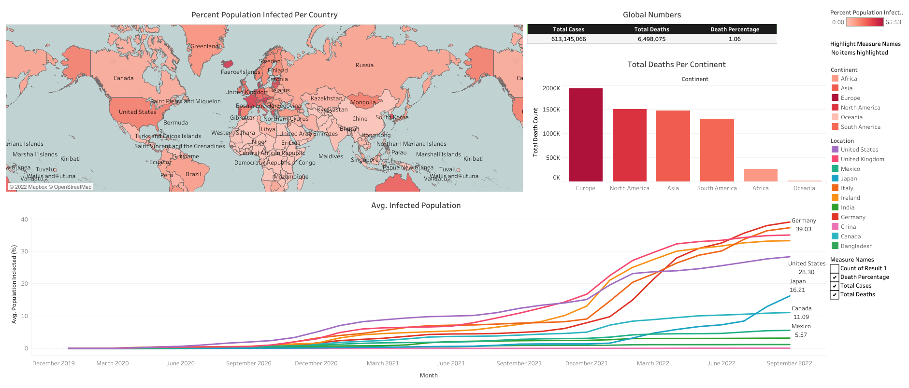
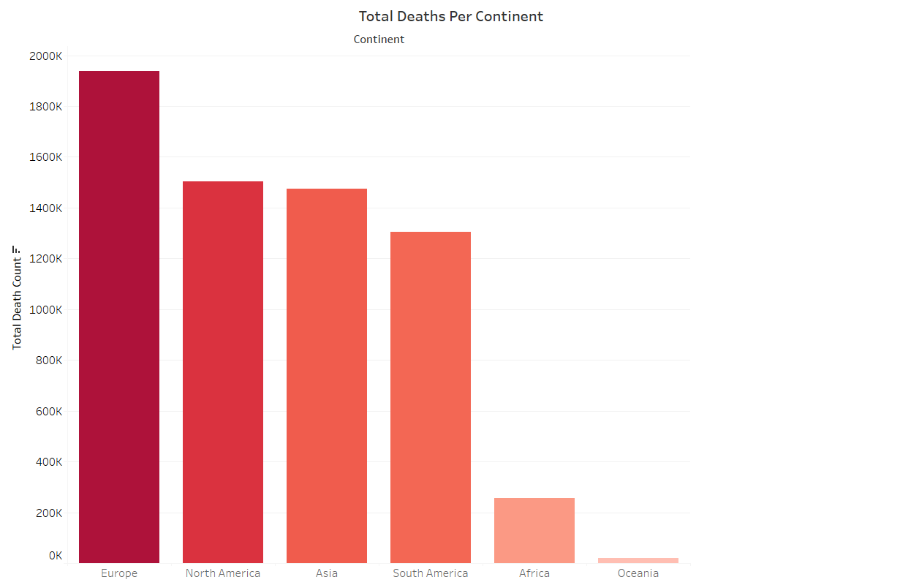
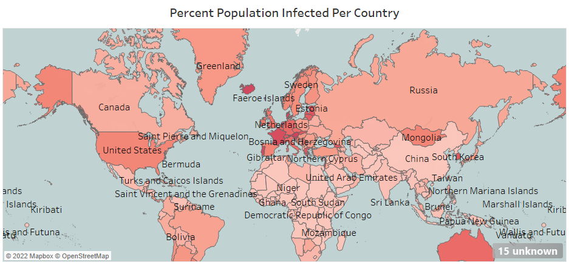
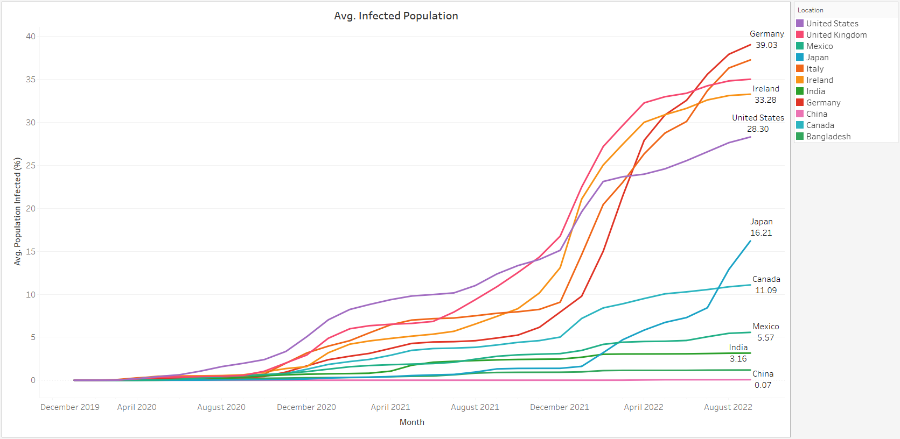

# COVID.Death

 `Active`

A contagious illness called `Coronavirus Disease (COVID-19)` is brought on by the `SARS-CoV-2 Virus`.
Most COVID-19 patients experience mild to moderate symptoms and recover without special treatment.
However, some will become seriously ill and require medical attention. [🔗](https://en.wikipedia.org/wiki/COVID-19)

The global dataset of the `Coronavirus Disease (COVID-19)` is examined in this study with the major focuses being on
`mortality` and `vaccination`. By the project's conclusion, it will be possible to display a variety of elements relating
to humans and the Coronavirus, including effects, comparisons, time-series, and many more.

**Dataset:** [Coronavirus (COVID-19) Deaths 🔗](https://ourworldindata.org/covid-deaths)

## Goals

The main objectives of this project include:

1. `Exploring` and `Analyzing` the global dataset Coronavirus.
2. Constructing an `Interactive Dashboard` to display the Coronavirus's global impact.

## Used Technologies

* `MySql`: Exploring, analysing and generating dataset for visualization.
* `Tableau`: Creating dashboard.
* `IDE`: [DataGrip](https://www.jetbrains.com/datagrip/)

## Description

Querying and visualization make up the two sections of this project. It is handled separately for each part.
The SQL files `introduction.sql`, `death.sql`, `vaccination.sql`, and `death_and_vaccination.sql` provide the queries
for data exploration. To generate the resources required for data visualization, there is one more file named
`tableau.sql`. The original Tableau visualization file is available at this URL - [Tableau: Covid - 19 Infected
Population](https://public.tableau.com/app/profile/myte/viz/Covid-19InfectedPopulation/Dashboard1).
A discussion of additional details follows. So, let's get started.

### Queries

#### Introduction

The first question regarding the [Coronavirus (COVID-19) Deaths](https://ourworldindata.org/covid-deaths) dataset is
what fields we will come across and which of them will be most helpful for this survey. Calculating the affected and
mortality numbers is crucial based on previous pandemic experiences. The provision of medical care and prevention are
the next things following them. Therefore, we separated our actual dataset into two separate datasets based on `death`
and `vaccination`. The `introduction.sql` query has a section on this.

#### Deaths

In calculating the overall number of cases and deaths for all locations, we discover that the `USA` has the highest number
of `Covid-19` instances and fatalities. However, among all the nations, `Africa` ranks last in both of these categories.
The `Faeroe Islands`, on the other hand, are the nation with the highest level of contamination, as measured by the
proportion of its population that is infected with Covid-19. Of all the continents, `Europe` has the highest death
rate (19,38,508). In conclusion, there have been a total of `6,131,45,066` cases and `64,98,075` fatalities from
Covid-19 worldwide, resulting in a mortality rate of `1.059%`. `death.sql` file contains records that were produced.

#### Death & Vaccination

The number of `Covid-19` fatalities and casualties is increasing daily. However, as `vaccinations` have advanced,
so has the rate of immunization. The `death_and_vaccination.sql` file contains the development for this statement.
We also established a `temporary table` and `view` in this part for upcoming analysis.

### Visualizations

To better understand just how dangerous this Coronavirus is, consider `visualizing` Covid-19's impact on the entire planet.
In order to accomplish this, we query some crucial data from the dataset and display it in an understandable manner (visualization).
We'll go over each visualization separately. However, [Tableau: Covid - 19 Infected
Population](https://public.tableau.com/app/profile/myte/viz/Covid-19InfectedPopulation/Dashboard1) -
is where you'll find the visualization's dashboard.

#### Global Numbers
We can see that there are `613,145,066` cases of `Covid-19` infections worldwide when we take the entire planet into account. 
Of those affected, `6,498,075` have passed away. So from the beginning to the present, the death rate is `1.06%`.

#### Deaths in Continents
From the `6 continents` (Europe, North America, Asia, South Asia, Africa and Oceania), **highest** number of fatalities is in the `Europe`. 
North America and Asia is the next most death counted continents respectively. Despite being lower, South America is 
relatively near to Asia. `Africa` and `Oceania`, however, are at the bottom of the global rankings, respectively.  

#### Infected Population
Here, we're simulating the global spread of the `Covid-19 virus` using a `dashboard map`. This is a quick overview of the 
harmful effects of the coronavirus around the world. The nations on the continents of `Europe and North America` are 
undoubtedly the ones with the `worst infections` worldwide.

It is not necessary to keep track of the global increase in Covid-19 infection rates. Therefore, we'll focus on a 
selected group of 11 countries (United States, United Kingdom, Mexico, Bangladesh etc.). Analyzing the line graph that 
shows the average rising number of Covid-19 infected people in various countries makes it clear that the `United States` 
is increasing at a steady rate. `Germany`, on the other hand, experienced a modest growth rate up until December 2021, 
but after that, it swiftly picked up and eventually reached the highest Covid-19 infection rate. The same screening 
applies to `Japan`, the `United Kingdom`, `Ireland`, and `Italy`. In `Canada`, `Mexico`, and `India`, the average population infection 
rate is modest. It is unexpected that `China` and `Bangladesh` have far lower than average rates of coronavirus infection.

